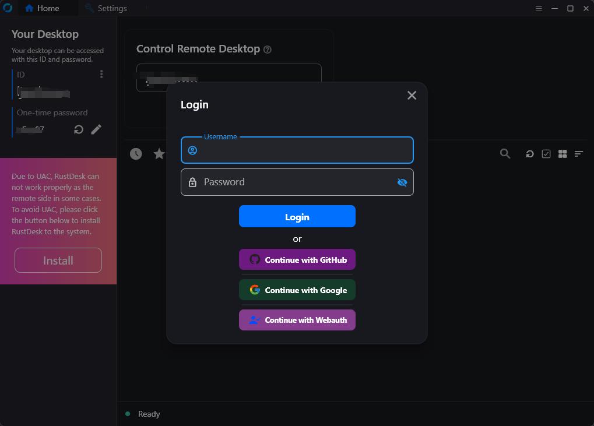
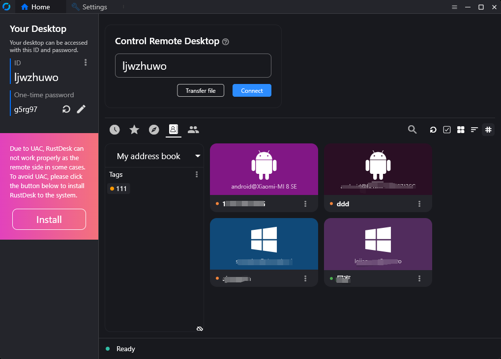
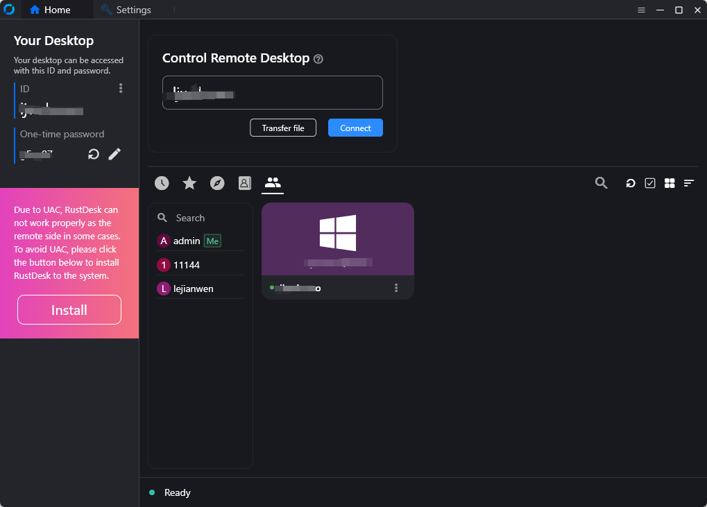
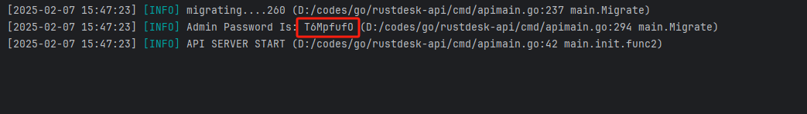
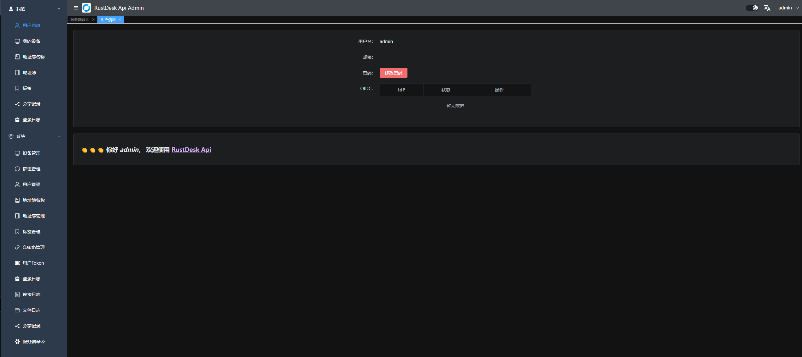
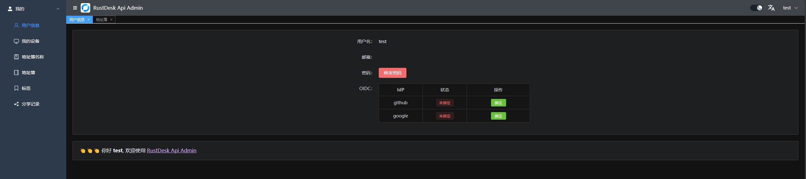
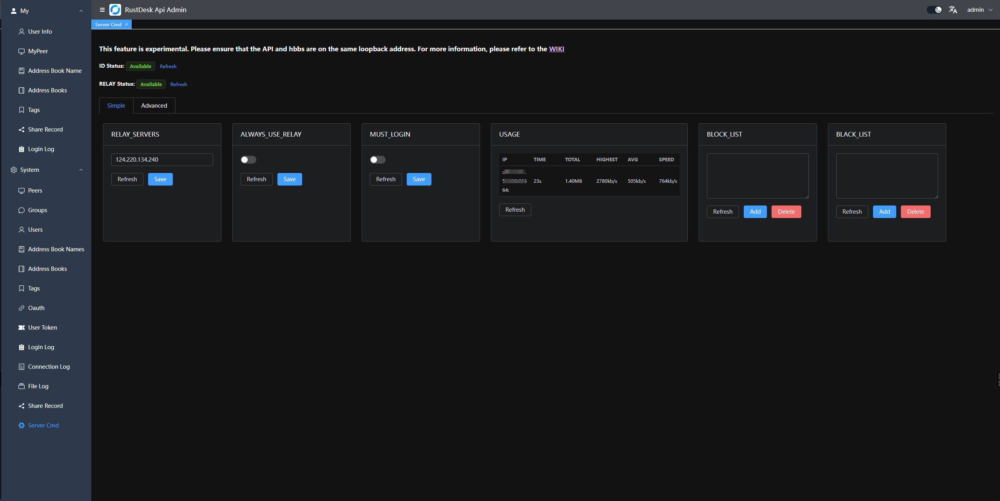
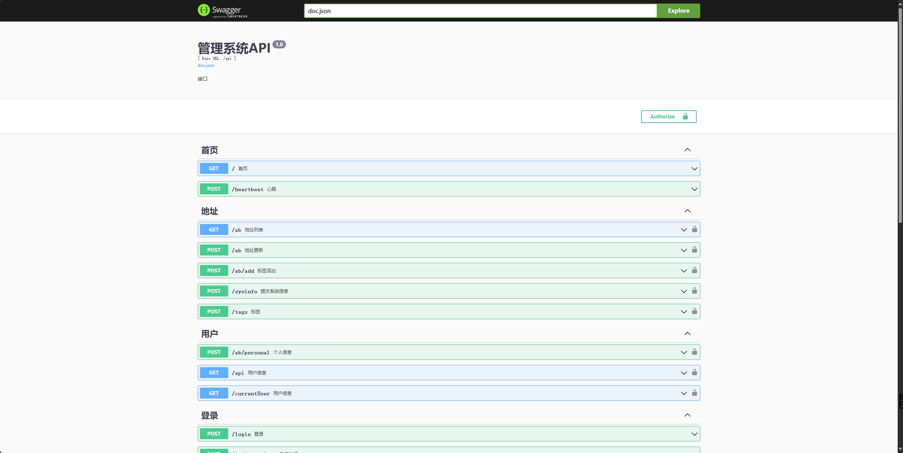

# RustDesk API

[English Doc](README_EN.md) | [Tài liệu Tiếng Trung](README_CN.md)

Dự án này sử dụng Go để triển khai các API của RustDesk, đồng thời tích hợp cả giao diện quản trị Web Admin và Web Client. RustDesk là một phần mềm điều khiển máy tính từ xa mã nguồn mở cung cấp các giải pháp tự lưu trữ (self-hosted).

<div align=center>


</div>

## Khuyên dùng kết hợp với [lejianwen/rustdesk-server].
> [lejianwen/rustdesk-server] được fork từ kho lưu trữ RustDesk Server chính thức.
> 1. Giải quyết vấn đề hết hạn kết nối (timeout) của API.
> 2. Có thể bắt buộc đăng nhập trước khi thiết lập kết nối từ xa.
> 3. Hỗ trợ kết nối websocket phía client.

---

# Các tính năng chính

- **API cho ứng dụng PC**
    - API phiên bản cá nhân (Personal API).
    - Đăng nhập (Login).
    - Sổ địa chỉ (Address Book).
    - Nhóm (Groups).
    - Đăng nhập thông qua bên thứ ba (Authorized login):
      - Hỗ trợ đăng nhập bằng `GitHub`, `Google` và `OIDC`.
      - Hỗ trợ đăng nhập được ủy quyền qua `giao diện quản trị web`.
      - Hỗ trợ LDAP (đã kiểm thử hoạt động tốt với Active Directory và OpenLDAP) nếu Máy chủ API được cấu hình.
    - Hỗ trợ đa ngôn ngữ (i18n).
- **Trang Quản trị Web (Web Admin)**
    - Quản lý người dùng (User Management).
    - Quản lý thiết bị (Device Management).
    - Quản lý sổ địa chỉ (Address Book Management).
    - Quản lý nhãn/thẻ (Tag Management).
    - Quản lý nhóm (Group Management).
    - Quản lý liên kết OAuth (OAuth Management).
    - Cấu hình LDAP qua file cấu hình hoặc biến môi trường.
    - Xem lịch sử đăng nhập (Login Logs).
    - Xem lịch sử kết nối (Connection Logs).
    - Xem lịch sử truyền file (File Transfer Logs).
    - Truy cập nhanh vào Web Client.
    - Hỗ trợ đa ngôn ngữ (i18n).
    - Chia sẻ thiết bị cho khách (Share to guest) qua Web Client.
    - Điều khiển server (gửi một số lệnh đơn giản qua [WIKI](https://github.com/lejianwen/rustdesk-api/wiki/Rustdesk-Command)).
- **Web Client**
    - Tự động nhận diện Máy chủ API.
    - Tự động nhận diện Máy chủ ID (ID server) và Khóa (KEY).
    - Tự động đồng bộ sổ địa chỉ.
    - Khách truy cập từ xa vào thiết bị thông qua liên kết chia sẻ tạm thời.
- **Giao diện dòng lệnh (CLI)**
    - Đặt lại mật khẩu tài khoản quản trị (admin).

---

## Tổng quan chức năng

### Dịch vụ API
Triển khai cơ bản các giao diện chính cho máy khách PC. Hỗ trợ API phiên bản Cá nhân, có thể bật bằng cách cấu hình trong file `rustdesk.personal` hoặc thông qua biến môi trường `RUSTDESK_API_RUSTDESK_PERSONAL`.

<table>
    <tr>
      <td width="50%" align="center" colspan="2"><b>Đăng nhập</b></td>
    </tr>
    <tr>
        <td width="50%" align="center" colspan="2"></td>
    </tr>
     <tr>
      <td width="50%" align="center"><b>Sổ địa chỉ</b></td>
      <td width="50%" align="center"><b>Nhóm</b></td>
    </tr>
    <tr>
        <td width="50%" align="center"></td>
        <td width="50%" align="center"></td>
    </tr>
</table>

### Giao diện quản trị Web (Web Admin)

* Dự án được thiết kế theo mô hình tách biệt Frontend và Backend để cung cấp một giao diện quản trị thân thiện với người dùng, chủ yếu dùng cho quản lý và hiển thị dữ liệu. Mã nguồn Frontend có sẵn tại [rustdesk-api-web](https://github.com/lejianwen/rustdesk-api-web).
* Đường dẫn truy cập trang quản trị: `http://<server-cua-ban[:port]>/_admin/`
* Đối với lần cài đặt đầu tiên, tài khoản quản trị mặc định là `admin`, và mật khẩu ngẫu nhiên sẽ được in trên cửa sổ console/log. Bạn có thể thay đổi mật khẩu này thông qua [CLI](#CLI).

  

1. Giao diện Admin:
   
2. Giao diện Người dùng thường:
   

3. Mỗi người dùng có thể sở hữu nhiều sổ địa chỉ và có thể chia sẻ chúng với những người dùng khác.
4. Các nhóm có thể được tùy chỉnh để dễ quản lý. Hiện tại hỗ trợ hai loại nhóm: `nhóm chia sẻ` (shared group) và `nhóm thường` (regular group).
5. Bạn có thể mở trực tiếp Web Client hoặc chia sẻ liên kết cho khách truy cập tạm thời vào thiết bị của mình mà không cần tài khoản.
6. Hỗ trợ OAuth: Hỗ trợ `GitHub`, `Google` và `OIDC`. Bạn cần tạo một `OAuth App` và cấu hình nó trong trang quản trị.
    - Với `Google` và `GitHub`, bạn không cần điền thông tin `Issuer` và `Scopes`.
    - Với `OIDC`, bạn bắt buộc phải cấu hình `Issuer`. Mục `Scopes` là tùy chọn (mặc định là `openid,email,profile`). Hãy đảm bảo OAuth App này có quyền truy cập các trường `sub`, `email` và `preferred_username`.
    - Tạo `GitHub OAuth App` tại `Settings` -> `Developer settings` -> `OAuth Apps` -> `New OAuth App` [tại đây](https://github.com/settings/developers).
    - Đặt đường dẫn `Authorization callback URL` là `http://<server-cua-ban[:port]>/api/oidc/callback`, ví dụ: `http://127.0.0.1:21114/api/oidc/callback`.
7. Nhật ký đăng nhập.
8. Nhật ký kết nối.
9. Nhật ký truyền tập tin.
10. Điều khiển server:
    - `Chế độ đơn giản`: Tích hợp giao diện đồ họa cho một số câu lệnh phổ biến giúp thực thi trực tiếp từ trang quản trị.
      
    - `Chế độ nâng cao`: Cho phép chạy trực tiếp các câu lệnh trong trang quản trị.
      * Có thể sử dụng các lệnh chính thức từ RustDesk.
      * Có thể thêm các câu lệnh tùy chỉnh.
      * Chạy câu lệnh tùy chỉnh.
11. **Hỗ trợ LDAP**: Khi bạn thiết lập LDAP (đã kiểm tra thành công với OpenLDAP và Active Directory), bạn có thể đăng nhập bằng thông tin người dùng từ máy chủ LDAP của bạn. Chi tiết: [Issue #114](https://github.com/lejianwen/rustdesk-api/issues/114). Nếu xác thực LDAP thất bại, hệ thống sẽ tự động chuyển sang kiểm tra người dùng cục bộ.

### Web Client

1. Nếu bạn đã đăng nhập vào giao diện quản trị Web Admin, Web Client sẽ tự động được đăng nhập.
2. Nếu chưa đăng nhập, chỉ cần click nút đăng nhập ở góc trên bên phải, Máy chủ API đã được tự động cấu hình sẵn.
3. Sau khi đăng nhập thành công, Máy chủ ID và Key sẽ tự động được đồng bộ.
4. Danh bạ sổ địa chỉ cũng sẽ tự động được lưu vào Web Client để tiện sử dụng.

### Tài liệu API tự động
Tài liệu API được tạo tự động bằng Swag giúp các lập trình viên dễ dàng hiểu và tích hợp.

1. Tài liệu trang quản trị (Admin): `<server-cua-ban[:port]>/admin/swagger/index.html`
2. Tài liệu API ứng dụng khách (PC): `<server-cua-ban[:port]>/swagger/index.html`
   

### Các Endpoint API bổ sung phục vụ Client & CLI

Dưới đây là tài liệu sơ lược các API bổ sung hỗ trợ quản lý thiết bị, kiểm tra (audit) kết nối và đồng bộ thông tin nâng cao:

#### 1. Đăng ký & Triển khai Thiết bị (Device Deploy)
* **Endpoint**: `POST /api/devices/deploy`
* **Xác thực**: `Authorization: Bearer <token>`
* **Mô tả**: Dùng khi triển khai thiết bị mới lên server. Đăng ký thiết bị kèm khóa công khai (Public Key).
* **Yêu cầu (Request Body)**:
  ```json
  {
    "id": "device-id",
    "uuid": "base64-uuid",
    "pk": "base64-public-key"
  }
  ```
* **Phản hồi (Response)**:
  ```json
  {
    "result": "OK" // Hoặc "ID_TAKEN" nếu ID thiết bị đã thuộc tài khoản khác
  }
  ```

#### 2. Quản lý Thiết bị qua Giao diện Dòng lệnh (CLI Device Management)
* **Endpoint**: `POST /api/devices/cli`
* **Xác thực**: `Authorization: Bearer <token>`
* **Mô tả**: Cập nhật thông tin thiết bị từ xa qua CLI, cho phép chuyển quyền sở hữu (User), đưa vào nhóm (Group), hoặc tự động khởi tạo/cập nhật thông tin thiết bị trong Sổ địa chỉ (Address Book).
* **Yêu cầu (Request Body)**:
  ```json
  {
    "id": "device-id",
    "uuid": "base64-uuid",
    "user_name": "username-dich",             // Tùy chọn: chuyển thiết bị sang user này
    "device_group_name": "ten-nhom-thiet-bi", // Tùy chọn: đưa thiết bị vào nhóm này
    "address_book_name": "ten-so-dia-chi",    // Tùy chọn: tự động tạo/cập nhật sổ địa chỉ với tên này
    "address_book_tag": "tag1,tag2",          // Tùy chọn: nhãn gán cho thiết bị trong sổ địa chỉ
    "address_book_alias": "ten-goi-nho",      // Tùy chọn: tên gợi nhớ trong sổ địa chỉ
    "address_book_password": "mat-khau",      // Tùy chọn: mật khẩu lưu trong sổ địa chỉ
    "address_book_note": "ghi-chu-ab",        // Tùy chọn: ghi chú
    "note": "ghi-chu-thiet-bi-chung",         // Tùy chọn: đổi tên hiển thị (alias) của thiết bị
    "device_username": "os-username",         // Tùy chọn: tên đăng nhập HĐH của thiết bị
    "device_name": "os-hostname"              // Tùy chọn: tên máy tính
  }
  ```
* **Phản hồi (Response)**: HTTP `200 OK` (không có nội dung) nếu thành công.

#### 3. Truy vấn phiên kết nối đang hoạt động (Active Connection Audit)
* **Endpoint**: `GET /api/audit/conn/active`
* **Xác thực**: `Authorization: Bearer <token>`
* **Mô tả**: Lấy mã định danh phiên kết nối (`guid`) đang hoạt động của thiết bị thuộc quyền sở hữu của user hiện tại.
* **Tham số truy vấn (Query Params)**: `id={peer_id}&session_id={session_id}&conn_type={type}`
* **Phản hồi (Response)**: Chuỗi JSON chứa mã `guid` duy nhất.

#### 4. Cập nhật ghi chú phiên kết nối (Update Connection Note)
* **Endpoint**: `PUT /api/audit`
* **Xác thực**: `Authorization: Bearer <token>`
* **Mô tả**: Ghi nhận ghi chú (note) từ client sau khi kết thúc phiên kết nối.
* **Yêu cầu (Request Body)**:
  ```json
  {
    "guid": "audit-guid-cua-phien",
    "note": "nội dung ghi chú"
  }
  ```
* **Phản hồi (Response)**: HTTP `200 OK` nếu cập nhật thành công.

#### 5. Báo cáo cảnh báo bất thường (Audit Alarm)
* **Endpoint**: `POST /api/audit/alarm`
* **Mô tả**: Client tự động báo cáo các cảnh báo hoặc sự cố đăng nhập thất bại.
* **Yêu cầu (Request Body)**:
  ```json
  {
    "id": "peer-id",
    "uuid": "device-uuid",
    "typ": "alarm-type",
    "info": "thông tin chi tiết về alarm"
  }
  ```
* **Phản hồi (Response)**: HTTP `200 OK`.

---

## Giao diện dòng lệnh (CLI)

```bash
# Xem hướng dẫn sử dụng
./apimain -h
```

#### Đặt lại mật khẩu quản trị (Admin)
```bash
./apimain reset-admin-pwd <mat_khau_moi>
```

---

## Hướng dẫn cài đặt và thiết lập

### Cấu hình

* [File cấu hình](./conf/config.yaml)
* Chỉnh sửa các cấu hình trong file `conf/config.yaml`.
* Nếu `gorm.type` được đặt là `sqlite`, bạn không cần cấu hình thêm các tham số liên quan đến MySQL.
* Ngôn ngữ mặc định được đặt là `vi` (Tiếng Việt) sau khi dịch, hoặc hỗ trợ `en` và `zh-CN`.

### Biến môi trường
Các biến môi trường tương ứng 1-1 với cấu hình trong file `conf/config.yaml`. Tiền tố của các biến môi trường này là `RUSTDESK_API`.
Bảng dưới đây không liệt kê tất cả cấu hình. Vui lòng tham khảo trực tiếp trong file `conf/config.yaml`.

| Tên biến môi trường | Mô tả | Ví dụ |
|--------------------------------------------------------|-----------------------------------------------------------------------------------------------------------------------------------------------------|-------------------------------|
| TZ | Múi giờ | Asia/Ho_Chi_Minh |
| RUSTDESK_API_LANG | Ngôn ngữ mặc định | `vi`, `en`, `zh-CN` |
| RUSTDESK_API_APP_WEB_CLIENT | Bật/tắt web client; 1: Bật, 0: Tắt, mặc định: 1 | 1 |
| RUSTDESK_API_APP_REGISTER | Cho phép tự đăng ký tài khoản; `true`, `false`; mặc định: `false` | `false` |
| RUSTDESK_API_APP_SHOW_SWAGGER | Hiển thị tài liệu Swagger; 1: Có, 0: Không; mặc định: 0 | `0` |
| RUSTDESK_API_APP_TOKEN_EXPIRE | Thời hạn hiệu lực của Token | `168h` |
| RUSTDESK_API_APP_DISABLE_PWD_LOGIN | Vô hiệu hóa đăng nhập bằng mật khẩu | `false` |
| RUSTDESK_API_APP_REGISTER_STATUS | Trạng thái mặc định của tài khoản đăng ký; 1: Hoạt động, 2: Bị khóa; mặc định: 1 | `1` |
| RUSTDESK_API_APP_CAPTCHA_THRESHOLD | Số lần đăng nhập sai tối đa để yêu cầu mã captcha; -1: Tắt, 0: Luôn bật, >0: Bật sau khi sai n lần; mặc định: `3` | `3` |
| RUSTDESK_API_APP_BAN_THRESHOLD | Số lần đăng nhập sai tối đa để khóa IP; 0: Tắt, >0: Khóa sau khi sai n lần; mặc định: `0` | `0` |
| ----- Cấu hình ADMIN ----- | ---------- | ---------- |
| RUSTDESK_API_ADMIN_TITLE | Tiêu đề trang quản trị | `RustDesk Api Admin` |
| RUSTDESK_API_ADMIN_HELLO | Lời chào trang quản trị (hỗ trợ định dạng `html`) | |
| RUSTDESK_API_ADMIN_HELLO_FILE | File chứa nội dung lời chào (sẽ ghi đè lên giá trị `RUSTDESK_API_ADMIN_HELLO`) | `./conf/admin/hello.html` |
| ----- Cấu hình GIN ----- | --------------------------------------- | ----------------------------- |
| RUSTDESK_API_GIN_TRUST_PROXY | Danh sách IP Proxy đáng tin cậy, ngăn cách bởi dấu phẩy | 192.168.1.2,192.168.1.3 |
| ----- Cấu hình GORM ----- | --------------------------------------- | ----------------------------- |
| RUSTDESK_API_GORM_TYPE | Loại cơ sở dữ liệu (`sqlite` hoặc `mysql` hoặc `postgresql`). Mặc định: `sqlite`. | sqlite |
| RUSTDESK_API_GORM_MAX_IDLE_CONNS | Số kết nối rảnh tối đa | 10 |
| RUSTDESK_API_GORM_MAX_OPEN_CONNS | Số kết nối tối đa được mở | 100 |
| RUSTDESK_API_RUSTDESK_PERSONAL | Kích hoạt API Cá nhân (Personal API); 1: Bật, 0: Tắt | 1 |
| ----- Cấu hình MYSQL ----- | --------------------------------------- | ----------------------------- |
| RUSTDESK_API_MYSQL_USERNAME | Tài khoản kết nối MySQL | root |
| RUSTDESK_API_MYSQL_PASSWORD | Mật khẩu kết nối MySQL | 111111 |
| RUSTDESK_API_MYSQL_ADDR | Địa chỉ MySQL | 192.168.1.66:3306 |
| RUSTDESK_API_MYSQL_DBNAME | Tên cơ sở dữ liệu MySQL | rustdesk |
| RUSTDESK_API_MYSQL_TLS | Có bật bảo mật TLS hay không: `true`, `false`, `skip-verify`, `custom` | `false` |
| ----- Cấu hình RUSTDESK ----- | --------------------------------------- | ----------------------------- |
| RUSTDESK_API_RUSTDESK_ID_SERVER | Địa chỉ máy chủ ID của RustDesk | 192.168.1.66:21116 |
| RUSTDESK_API_RUSTDESK_RELAY_SERVER | Địa chỉ máy chủ Relay của RustDesk | 192.168.1.66:21117 |
| RUSTDESK_API_RUSTDESK_API_SERVER | Địa chỉ máy chủ API của RustDesk | http://192.168.1.66:21114 |
| RUSTDESK_API_RUSTDESK_KEY | Khóa công khai của RustDesk (Key) | 123456789 |
| RUSTDESK_API_RUSTDESK_KEY_FILE | File chứa khóa công khai | `./conf/data/id_ed25519.pub` |
| RUSTDESK_API_RUSTDESK_WEBCLIENT_MAGIC_QUERYONLINE | Bật phương pháp truy vấn trạng thái trực tuyến mới trong Web Client v2; 1: Có, 0: Không | `0` |
| RUSTDESK_API_RUSTDESK_WS_HOST | Địa chỉ Websocket tùy chỉnh | `wss://192.168.1.123:4443` |
| ---- Cấu hình PROXY ---- | --------------- | ---------- |
| RUSTDESK_API_PROXY_ENABLE | Bật sử dụng Proxy: `true`, `false` | `false` |
| RUSTDESK_API_PROXY_HOST | Địa chỉ Proxy | `http://127.0.0.1:1080` |
| ---- Cấu hình JWT ---- | -------- | -------- |
| RUSTDESK_API_JWT_KEY | Mã khóa JWT, để trống sẽ vô hiệu hóa JWT | |
| RUSTDESK_API_JWT_EXPIRE_DURATION | Thời gian hết hạn JWT | `168h` |

---

### Hướng dẫn cài đặt chi tiết

#### Chạy bằng Docker

1. Chạy trực tiếp qua Docker. Bạn có thể gắn kết file cấu hình qua đường dẫn `/app/conf/config.yaml` hoặc ghi đè bằng các biến môi trường.

    ```bash
    docker run -d --name rustdesk-api -p 21114:21114 \
    -v /data/rustdesk/api:/app/data \
    -e TZ=Asia/Ho_Chi_Minh \
    -e RUSTDESK_API_LANG=vi \
    -e RUSTDESK_API_RUSTDESK_ID_SERVER=192.168.1.66:21116 \
    -e RUSTDESK_API_RUSTDESK_RELAY_SERVER=192.168.1.66:21117 \
    -e RUSTDESK_API_RUSTDESK_API_SERVER=http://192.168.1.66:21114 \
    -e RUSTDESK_API_RUSTDESK_KEY=<key_cua_ban> \
    lejianwen/rustdesk-api
    ```

2. **Chạy bằng `docker-compose` (Khuyên dùng)**:
   Cấu hình `docker-compose.yaml` đã được thiết lập sẵn ở thư mục gốc của dự án. Cấu hình này sẽ tự động:
   * Biên dịch (build) mã nguồn API cục bộ (bao gồm cả frontend Web Admin và backend API).
   * Khởi chạy máy chủ RustDesk ID (hbbs) và Relay (hbbr).
   * Khởi chạy Nginx làm Reverse Proxy để cấu hình bảo mật HTTPS và Websocket cho Web Client.

   **Cách khởi chạy**:
   * Sao chép tệp `.env.example` thành `.env`:
     ```bash
     cp .env.example .env
     ```
   * Chỉnh sửa tệp `.env` để thiết lập tên miền của bạn (`DOMAIN`), múi giờ (`TZ`) và khóa bảo mật JWT (`JWT_SECRET`).
   * Đặt các tệp chứng chỉ SSL (`fullchain.pem` và `privkey.pem`) của bạn vào thư mục `./certs/`.
   * Chạy lệnh sau để build và khởi động toàn bộ hệ thống:
     ```bash
     docker compose up --build -d
     ```


#### Sử dụng các bản Release được biên dịch sẵn

Tải phiên bản mới nhất từ trang [Releases](https://github.com/lejianwen/rustdesk-api/releases).

#### Biên dịch từ mã nguồn

1. Sao chép kho lưu trữ (Clone):
   ```bash
   git clone https://github.com/lejianwen/rustdesk-api.git
   cd rustdesk-api
   ```

2. Tải các thư viện phụ thuộc:
   ```bash
   go mod tidy
   # Cài đặt công cụ Swag nếu cần tạo tài liệu API Swagger; nếu không có thể bỏ qua
   go install github.com/swaggo/swag/cmd/swag@latest
   ```

3. Biên dịch giao diện quản trị Web Admin (Mã nguồn nằm trong dự án [rustdesk-api-web](https://github.com/lejianwen/rustdesk-api-web)):
   ```bash
   cd resources
   mkdir -p admin
   git clone https://github.com/lejianwen/rustdesk-api-web
   cd rustdesk-api-web
   npm install
   npm run build
   cp -ar dist/* ../admin/
   ```

4. Khởi chạy:
   ```bash
   # Chạy trực tiếp từ mã nguồn
   go run cmd/apimain.go
   # Hoặc tự sinh mã API bằng generate_api.go trước khi chạy
   go generate generate_api.go
   ```
   > **Lưu ý:** Khi sử dụng `go run` hoặc chạy file biên dịch, hai thư mục `conf` và `resources` bắt buộc phải nằm cùng cấp trong thư mục đang chạy. Nếu bạn khởi chạy ở thư mục khác, vui lòng chỉ định đường dẫn tuyệt đối bằng tham số `-c` và biến môi trường `RUSTDESK_API_GIN_RESOURCES_PATH`. Ví dụ:
   > ```bash
   > RUSTDESK_API_GIN_RESOURCES_PATH=/opt/rustdesk-api/resources ./apimain -c /opt/rustdesk-api/conf/config.yaml
   > ```

5. Để biên dịch, quay lại thư mục gốc của dự án. Trên Windows chạy `build.bat`, trên Linux chạy `build.sh`. Các file thực thi sẽ được xuất ra thư mục `release`.

6. Truy cập `http://<server-cua-ban[:port]>/_admin/`, đăng nhập bằng tài khoản/mật khẩu mặc định là `admin` / `admin`. Hãy đổi mật khẩu ngay sau đó.

#### Chạy với hình ảnh s6 server fork từ lejianwen/server-s6

- Đã sửa lỗi API kết nối timeout.
- Bắt buộc đăng nhập trước khi điều khiển từ xa.
- Github: https://github.com/lejianwen/rustdesk-server

```yaml
 networks:
   rustdesk-net:
     external: false
 services:
   rustdesk:
     ports:
       - 21114:21114
       - 21115:21115
       - 21116:21116
       - 21116:21116/udp
       - 21117:21117
       - 21118:21118
       - 21119:21119
     image: lejianwen/rustdesk-server-s6:latest
     environment:
       - RELAY=<relay_server[:port]>
       - ENCRYPTED_ONLY=1
       - MUST_LOGIN=N
       - TZ=Asia/Ho_Chi_Minh
       - RUSTDESK_API_RUSTDESK_ID_SERVER=<id_server[:21116]>
       - RUSTDESK_API_RUSTDESK_RELAY_SERVER=<relay_server[:21117]>
       - RUSTDESK_API_RUSTDESK_API_SERVER=http://<api_server[:21114]>
       - RUSTDESK_API_KEY_FILE=/data/id_ed25519.pub
       - RUSTDESK_API_JWT_KEY=xxxxxx # jwt key
     volumes:
       - /data/rustdesk/server:/data
       - /data/rustdesk/api:/app/data # Gắn kết dữ liệu cơ sở dữ liệu
     networks:
       - rustdesk-net
     restart: unless-stopped
```

---

## Liên kết khác

- [WIKI](https://github.com/lejianwen/rustdesk-api/wiki)
- [Vấn đề kết nối timeout](https://github.com/lejianwen/rustdesk-api/issues/92)
- [Thay đổi ID thiết bị](https://github.com/abdullah-erturk/RustDesk-ID-Changer)
- [Nguồn của Web Client](https://hub.docker.com/r/keyurbhole/flutter_web_desk)

## Đóng góp và ghi nhận

Xin chân thành cảm ơn tất cả những người đã đóng góp xây dựng dự án!

<a href="https://github.com/lejianwen/rustdesk-api/graphs/contributors">
  
</a>

## Ủng hộ dự án

Nếu dự án này giúp ích cho bạn, hãy nhấn ⭐️ để ủng hộ tác giả nhé. Xin cảm ơn!

[lejianwen/rustdesk-server]: https://github.com/lejianwen/rustdesk-server